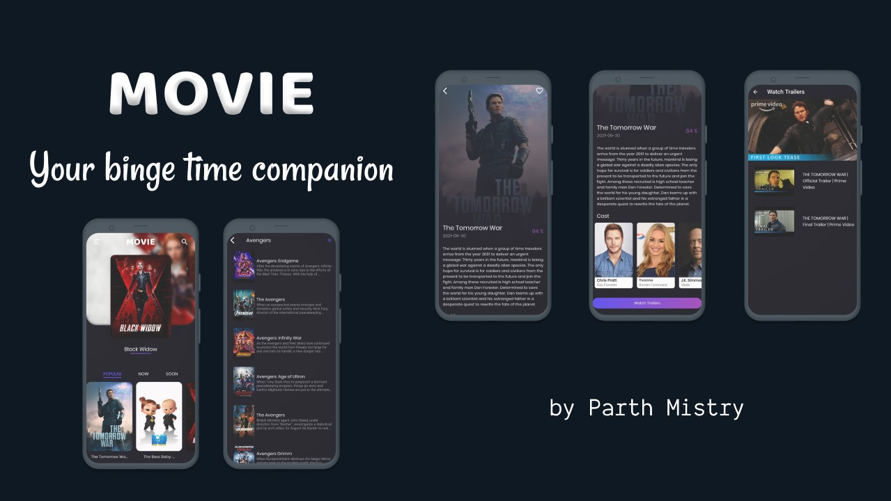

# Movie App
>by Parth Mistry

<div>
    
</div>

---
* A full fleged application to provide details of movies and its cast along with the trailers.
* Used industrial approaches to make the user interface of the  application responsible for all devices.
* Applied modern flutter practices like bloc and hive to control state and data throughout the application.
* Getting help from the TMDB API for all the movie details.
* Made use of packages like ```get_it```, ```dartz```, ```equatable``` for efficient memory management.
* CI/CD is implemented using Github Actions.

---
## Specifications:
**Flutter Version:** 2.3.0-24.1.pre - beta  
**Dart Version:** 2.14.0  
**Packages Used:** ```cached_network_image```, ```dartz```, ```equatable```, ```flare_flutter```, ```flutter_bloc```, ```flutter_svg```, ```get_it```, ```hive```, ```http```, ```wiredash```, ```youtube_player_flutter```

---
## Details:
* This is an application built on flutter which uses an **api** to fetch data and show it on the screen.
* The application uses popular **flutter bloc approach** along with **get-it dependency injection** to optimize the objects created during runtime.
* Implemented a **wiredash** support for a proper feedback of the user.
* This application will also provide **trailers** of the specific movies.
* A **TMDB account** will be required to access the application.
* The code structure is similar to the structure provided in the **VeryGoodVentures CLI**.
* This application also supports **internationalization** where it has two languages inbuilt i.e **English and Spanish**.
* User can also **search** any movie using the search feature.
---
## Screens:
<div>
  
 
 
</div>
<div>
  
 
 
</div>


---

Thanks to TechieBlossom: https://github.com/TechieBlossom

Parth Mistry © 2021
